<!-- ================= ANIMATED HEADER BANNER ================= -->

  

<!-- ================= TYPING / GLITCH LINE ================= -->

 

---

### **⚡ 01 // SYSTEM OVERVIEW**

> **"Bridging scalable technical infrastructure with high-impact visual storytelling."**

* **ACADEMIC CORE:** **Computer Science Undergraduate** at **NSBM Green University** (Faculty of Computing).
* **LEADERSHIP ROLE:** **President** of the **NFORCE Club**, orchestrating high-tech enterprise events and strategic board frameworks.
* **CREATIVE ENGINE:** **Founder & Lead Designer** at **Idis Graphix**, breaking standard frames to build custom digital experiences.
* **VISION:** Functioning as a live **"Knowledge Share Bank"** to elevate fellow developers and tech pioneers.

---

### **💻 02 // CORE ARCHITECTURES & MISSIONS**

| Module / Project | Technical Scope & Execution | Status / Links |
| :--- | :--- | :--- |
| **University Club Event Portal** | Full-cycle management portal handling functional requirements, cost schedules, and resource planning. | `Spring Boot` `GCP` |
| **Custom Video Editor** | High-performance rendering pipeline using modern APIs for non-destructive digital media creation. | `Java` `APIs` |
| **NFORCE Leadership & Tech Hub** | Directing strategic roadmap development, tech entrepreneurship programs, and board initiatives. | `Leadership` |

---

### **🎯 03 // SKILL PROFICIENCY RINGS**

  

---

### **🛠️ 04 // TECH STACK MATRIX**

  

---

### **📊 05 // LIVE TELEMETRY & ACTIVITY**

  

---

### **🌐 06 // ESTABLISH CONNECTION**

 

